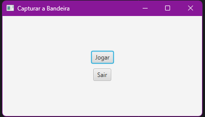
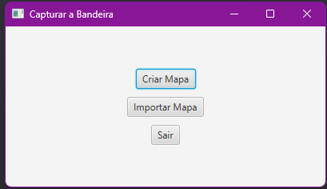
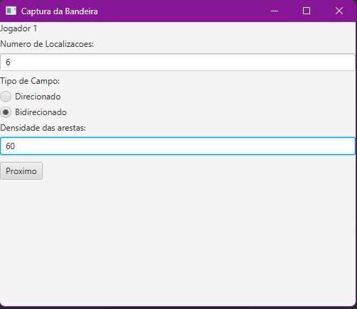
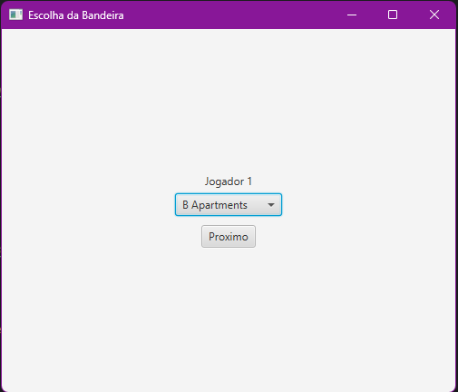
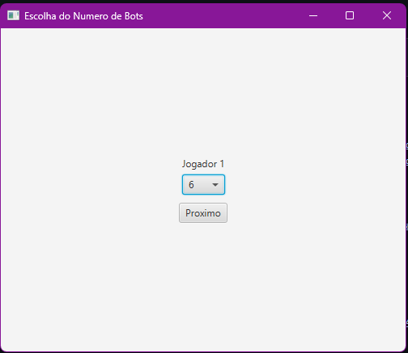
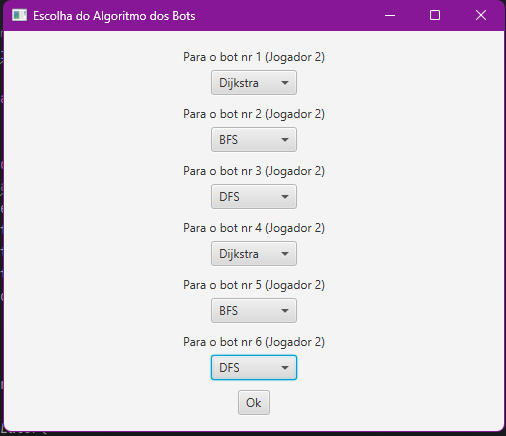
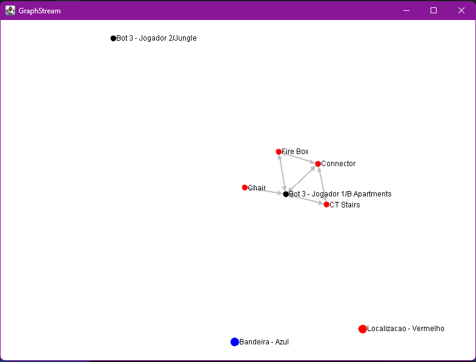
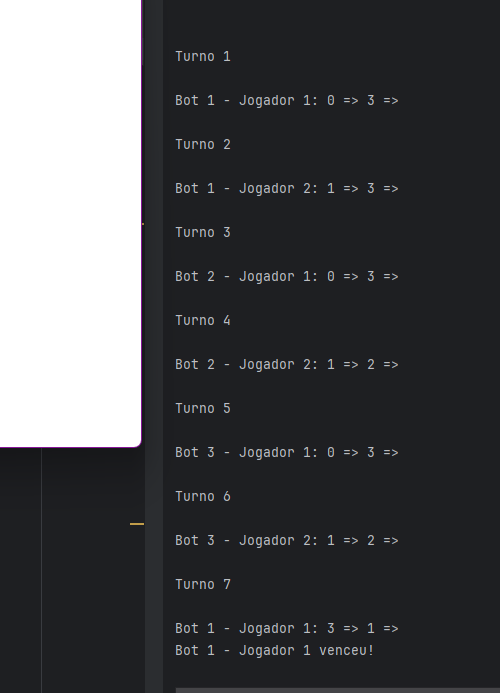

# Jogo "Capture the Flag"
## 📌 Resumo
### Em cada partida
  - ☑️ gera um novo mapa random (cria/importa ficheiro, e depois exporta ficheiro), onde os 2 jogadores acordam:
    - ✅ quantidade de localizações existentes no mapa (nodes; ex: áreas onde os jogadores podem movimentarem-se)
    - ✅ tipo de caminho que serão gerados (ex: bidirecional ou direcionado)
    - ✅ densidade das arestas (ex: 50% (num grafo direcionado indica que N*(N-1)**0.5 arestas devem estar presentes; num grafo bidirecionado indica que (N*(N-1)*0.5)/2))
    - ✅ random distâncias entre cada ponto (1km - 15km)
      
 - depois do mapa ser definido
   - ✅ os 2 jogadores selecionam a localização das bandeiras no mapa (têm que ser localizações diferentes; tem que guardar para depois ser possivel exportar ficheiro)
   - ✅ definem o número de bots que cada jogador terá a sua disponibilidade
     - ✅ atribuir a cada bot, um algoritmo (ex: caminho + curto, caminho + longo, ...; só pode permitir a repetição de algoritmos apenas se o número de bots ultrapassar o número disponível de algoritmos; criar >= 3 algortimos)

### Quando inicia a partida
 - ✅ o jogador que irá começar é random
 - ✅ os bots deverão estar localizados na mesma posição que a bandeira do seu jogador

### Em cada ronda, alternando pelos jogadores
 - ✅ um dos bots deverá movimentar-se
 - ✅ os bots devem adotar uma abordagem em que cada um, á vez, move-se de acordo com uma lógica sequencial, assegurando que cada bot tenha a sua oportunidade de avançar, sem a repetição imediata de movimentos, proporcionando assim uma distribuição equitativa das ações durante o jogo (ex: num jogo c 3 bots, joga o bot 1, dps o 2, seguindo do 3. Na 4º ronda, deve voltar ao bot 1).

### Executando na localização das bandeira
 - ☑️ um bot não se pode movimentar para uma posição em que esteja outro bot

### Jogo termina
 - ✅ quando um dos bots chega ao campo do inimigo
  
___
## 🧩 Interfaces
### Menu Inicial

  

### Criar Mapa (para cada jogador)

⚠️ Ao definir a densidade das arestas, se introduzir um valor maior que 20, o programa não funciona

  

### Escolher a localização da bandeira (para cada jogador)

  

### Escolher o número de bots (para cada jogador)

  

### Escolher os algortimos para os bots (para cada jogador)

  

### Grafo

  

### Partida

  

___
## ➕ Extras
- 🪲 Testes Unitários
- 🖼️ Interface Gráfica && Visualização do Grafo

___
## 🤝 Contribuições

Feito com 💜 e com ☕ por:

<table>
  <tr>
    <td align="center">
      <a href="https://github.com/heyliceeee">
         
        
          <b>Alice Dias</b>
        
      </a>
    </td>

<td align="center">
      <a href="https://github.com/SandroCunha8200785">
         
        
          <b>Sandro Cunha</b>
        
      </a>
    </td>
  </tr>
</table>
